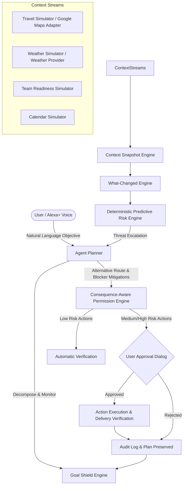

# LifeOS — Alexa+ Guardian Architecture

## 1. System Overview

LifeOS Guardian is an autonomous goal protection and personal operations agent built specifically for the **Amazon Alexa+ / MCP Hackathon**. Unlike traditional conversational chatbots that reactively answer one-off questions, Guardian adopts the core paradigm:

```
Goal > Command
Monitor > Respond
Replan > Notify
Explain > Black Box
Permission > Blind Autonomy
```



---

## 2. Core Engines

### 2.1 Goal Shield Engine
- Maintains persistent goal state (`draft`, `active`, `at_risk`, `blocked`, `completed`, `failed`).
- Evaluates verified success criteria:
  - `arrive_before_deadline`: Evaluated against current travel arrival time vs deadline.
  - `presentation_ready`: Evaluated against pitch slides completion.
  - `demo_ready`: Evaluated against end-to-end rehearsal tests.
  - `team_ready`: Evaluated against collaborator deliverable readiness.
- Computes real-time Goal Health Score (0–100%) with explainable rationale.

### 2.2 What-Changed Engine (Change Detector)
- Captures snapshots of operational context (travel ETA, buffer, weather, tasks, team).
- Computes structured deltas between successive snapshots.
- Answers:
  1. *What changed?* (e.g., Traffic increased ETA from 45m to 78m).
  2. *Does this change affect my goal?* (Arrival buffer drops from 30m to 5m; arrival deadline breached if unmitigated).
  3. *What should happen next?* (Switch to dedicated rail/transit corridor).

### 2.3 Predictive Risk Engine
- Purely deterministic, explainable scoring engine:
  - Deadline < 2 hours: `+30`
  - Travel buffer < 15 minutes: `+25`
  - Critical path task incomplete: `+25`
  - Downstream dependency blocked: `+20`
  - Adverse weather advisory: `+10`
  - Team member deliverable incomplete: `+10`
- Risk thresholds:
  - `0–29`: LOW RISK
  - `30–59`: MEDIUM RISK
  - `60–79`: HIGH RISK
  - `80–100`: CRITICAL RISK
- Guarantees explainable narratives rather than opaque numeric outputs.

### 2.4 Consequence-Aware Permission Engine
- Classifies every action into three permission tiers:
  - **LOW RISK (Auto-Permitted)**: Read calendar, fetch weather, compute ETA, analyze risk, save memory.
  - **MEDIUM RISK (Approval Required)**: Send external messages to team, switch itinerary route, modify deadlines.
  - **HIGH RISK (Explicit User Consent Mandatory)**: Financial transactions, booking cancellations, deleting data.
- Ensures LLM reasoning cannot bypass the authorization layer.

### 2.5 Action Verification Engine
- Verifies post-execution delivery (e.g., simulated Slack/SMS delivery confirmation).
- Logs idempotency keys (`goalId + actionType + targetId`) to prevent duplicate dispatch.
